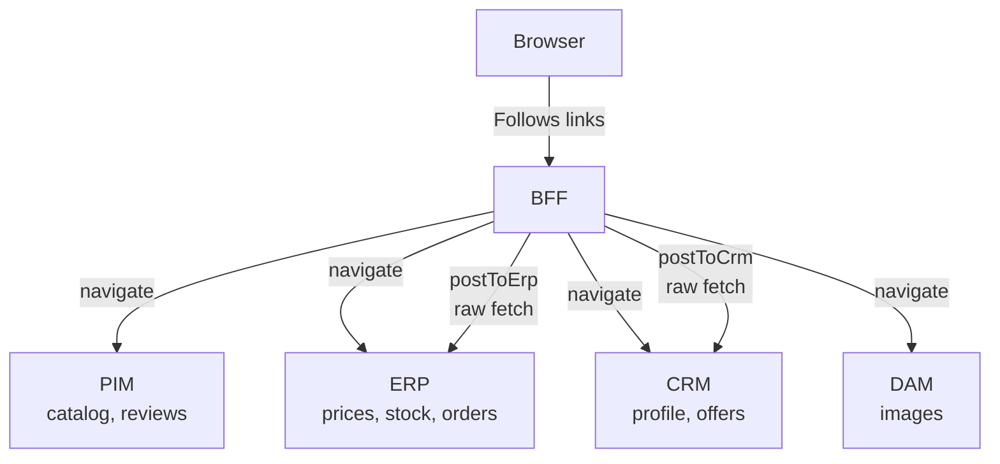

# The HATEOAS BFF Example

`examples/hateoas-bff/` is a realistic HATEOAS BFF showcase. `typesafe-hypermedia` is used **as a client** that consumes hypermedia APIs from four backend services (PIM, ERP, CRM, DAM) to aggregate their state into a single BFF response. It also demonstrates "HATEOAS dialed to the max": the BFF provides the entire application state on a single `GET /bff` route; the Alpine.js frontend is a pure renderer with no routing logic and no state management — its only meaningful API knowledge is the JSON shape of the BFF response (plus the single entry-point URL `/bff`).

The example uses `typesafe-hypermedia` at three points in the stack: to consume the backend hypermedia APIs (BFF → PIM/ERP/CRM/DAM), to define the typed link structure of the BFF's own responses, and in the end-to-end tests (`test/e2e/hateoas-bff-features.spec.ts`), which navigate the BFF API by following links rather than hardcoding endpoints — demonstrating that RESTful navigation via the library is a first-class testing strategy.

### Why HATEOAS at this level?

**Benefits**:
- Zero client-side business logic — the server determines what actions are available and under what conditions
- State management is trivial on the client: no reducers, no stores, the frontend re-renders whatever JSON it receives; writing an alternative or additional consumer (web, mobile, CLI) means implementing the renderer, not reimplementing business logic
- The frontend becomes a thin shell that renders whatever shape it receives, not an independent state machine

**Drawbacks**:
- The BFF becomes the single complexity owner — all view logic, aggregation, and state transitions live here
- All views must be anticipatable server-side at design time; emergent client-driven UI is harder to add
- Cache granularity is coarser — the entire application state is one resource, so partial cache invalidation is not possible

## 1. Architecture



Everything runs in one Fastify process for ease of running. The logical separation is:

- `backends/pim-routes.ts` — catalog, products by tag/search/category, reviews, related products
- `backends/erp-routes.ts` — price quotes, real-time stock, orders
- `backends/crm-routes.ts` — customer profile, loyalty points, promo offers
- `backends/dam-routes.ts` — images by SKU (404 when absent)
- `bff-api.ts` — `QuerySchema`, `FrontendStateSchema`, link definitions
- `bff-routes.ts` — the aggregator: one strict `GET /bff` entry point (no parameters, fresh session only), eight dedicated per-view routes (`/bff/home`, `/bff/category`, `/bff/product`, `/bff/search`, `/bff/cart`, `/bff/wishlist`, `/bff/orders`, `/bff/order-confirmation`), plus five `POST-via-GET` action routes

## 1b. Link conventions by backend

Each backend uses a different link representation to demonstrate that `typesafe-hypermedia`
is format-agnostic (see AGENTS.md Core Concept #5 and `docs/how-it-works.md §9`):

| Backend | Link pattern | Example | Why |
|---------|-------------|---------|-----|
| **PIM** | Flat `*Url` string (GitHub / JSON-LD style) | `categoriesUrl: "/pim/categories"` | Minimal JSON payload; no per-link metadata needed |
| **ERP** | Flat `*Url` string | `ordersUrl: "/erp/orders"` | Same as PIM; ERP sub-resources rename links for clarity (`stockUrl` → `checkStockUrl`) |
| **CRM** | Flat `*Url` string | `profileUrl: "/crm/profile"` | Smallest API; same pattern for consistency with PIM/ERP |
| **DAM** | HAL-style `_links.href` object | `_links.assets.href: "/dam/assets"` | Demonstrates interop with pre-existing HAL services |
| **BFF** | Link objects `{ title, href, … }` | `nav.cart: { title: "Cart (3)", href: "…", count: 3 }` | Frontend needs per-link metadata (labels, counts, toggle state) that flat strings cannot carry |

The variation is deliberate: a BFF often integrates services that predate any internal
convention. `defineLinks` adapts to the wire format rather than mandating one.

## 2. Routing and query-string as application state

The view is encoded in the **route path**, not a query parameter. Each view has its own dedicated route with exactly the query fields it needs — Fastify validates required ones automatically and returns 400 Bad Request when they are absent:

| Route | Required params | Optional params |
|---|---|---|
| `GET /bff` | — | none (strict entry point, fresh session only) |
| `GET /bff/home` | — | `cart*`, `wishlist*`, toast |
| `GET /bff/category` | `category` | `sort`, `cart*`, `wishlist*`, toast |
| `GET /bff/product` | `sku` | `category` (origin context), `search` (search-origin context), `cart*`, `wishlist*`, toast |
| `GET /bff/search` | `search` | `cart*`, `wishlist*`, toast |
| `GET /bff/cart` | — | `cart*`, `wishlist*`, toast |
| `GET /bff/wishlist` | — | `cart*`, `wishlist*`, toast |
| `GET /bff/orders` | — | `cart*`, `wishlist*`, toast |
| `GET /bff/order-confirmation` | `orderId` | `cart*`, `wishlist*`, toast |

Cart and wishlist are stored **entirely in the URL**; the BFF is stateless between requests.

`updatedStateUrl(query, update)` is the workhorse: it takes the current query, resets all transient fields (`message`, `title`, `variant`, `sku`, `view`, `sort`, `search`), applies the caller's update, then dispatches to `viewUrl()` which calls the correct per-view URL builder. Every navigation link in the app is built this way.

## 3. The `FrontendState` shape

`FrontendStateSchema` is grouped by concern so the JSON "reads like a wireframe". It is **not** a discriminated union — all groups are always present in the response, with view-specific fields optional inside each group:

```ts
FrontendState = {
    nav,              // always present — top nav bar (home, categories[], wishlist, cart with counts)
    view: {
        // Exactly one of the four sub-objects is populated per response.
        listing?: {       // home / category / search / wishlist / orders
            products,         // heading + cards[]
            sortOptions?,     // sort controls — category only
        },
        detail?: {        // product detail
            productDetails,   // name, desc, price, stock, images, reviews, addToCart
            recommendations?, // 'You might also like' cards
        },
        cart?: {          // cart view
            products,         // heading + cards[]
            cartSummary?,     // subtotal, discount, total, freeShipping
            checkout?,        // proceed-to-checkout link — present when cart is non-empty
            loyaltyEarn?,     // points you'd earn on checkout
            recommendations?, // 'You might also like' cards
        },
        confirmation?: {  // post-checkout
            summary,          // { orderId, total, itemCount }
            viewOrders?,      // link back to the orders list
        },
    },
    chrome: {         // surrounding chrome — present across all views
        breadcrumbs?,     // home → category → product trail
        toast?,           // { title, message, variant } — transient, from redirect query
        user?,            // { name, loyaltyPoints } from CRM
        promo?,           // auto-applied top offer from CRM
    },
    meta: {           // system / debug info — always present
        dataSources,      // which backends contributed to this response
    },
}
```

The client's job is to render whichever `view.*` sub-object is populated. Because every link is a real `href`, the browser can navigate through the entire app without any JavaScript routing logic.

## 4. Views and their backends

| View                 | Triggered by                              | Composes from |
|----------------------|-------------------------------------------|---------------|
| **Home**             | `view=home` (or no `view`)               | PIM (featured by tag) + ERP (quotes) |
| **Category**         | `view=category&category=<id>`            | PIM + ERP |
| **Product detail**   | `view=product&sku=<sku>`                 | PIM (product, reviews, related) + ERP (quote, stock) + DAM (images, optional) |
| **Cart**             | `view=cart`                              | PIM (names) + ERP (quotes) + CRM (offers for promo) — plus recommendations via PIM `relatedProductsUrl` |
| **Wishlist**         | `view=wishlist`                          | PIM + ERP |
| **Search results**   | `view=search&search=<q>`                 | PIM + ERP (when results) |
| **Orders list**      | `view=orders`                            | ERP |
| **Order confirmation** | `view=order-confirmation&orderId=<id>` | ERP (falls back to orders list + danger toast if id not found) |

Every view builder threads a `used: Set<SourceId>` and calls `used.add('pim'|'erp'|'crm'|'dam')` as it fetches. `buildDataSources(used)` turns the set into the `dataSources` field at the end. This gives the UI an automatic, honest attribution bar at the bottom of every page.

## 5. Action routes (POST-via-GET)

Five routes mutate state and redirect back to the main URL with a toast:

| Route                    | Effect                                                      | Uses       |
|--------------------------|-------------------------------------------------------------|------------|
| `add-to-cart`            | `postToErp(/erp/orders)` + cart append                      | raw fetch  |
| `remove-from-cart`       | splice cart by index                                        | none       |
| `save-for-later`         | splice cart, push to wishlist                               | none       |
| `toggle-wishlist`        | toggle sku in wishlist; preserves return view               | none       |
| `checkout`               | parallel `postToErp` fan-out for every cart sku; credits loyalty points to CRM via `postToCrm`; partial-failure aware redirect | raw fetch  |

The mutation routes use GET so that **the entire application is browsable** just by clicking links in the JSON response. The comment at the top of the action-routes section explains this and the `postToErp` workaround.

### Why `postToErp` and not `navigate()`?

`navigate()` currently has no way to carry a request body (tracked as roadmap §5 "Client-Provided Request Data"). So any POST to a backend has to be done with raw `fetch`:

```ts
// Workaround helper — see docs/roadmap.md §5
export async function postToErp<T>(baseUrl: string, path: string, body: unknown): Promise<T> {
    const response = await fetch(`${baseUrl}${path}`, {
        method: 'POST',
        headers: { 'Content-Type': 'application/json' },
        body: JSON.stringify(body),
    });
    if (!response.ok) throw new Error(`ERP ${path} failed: ${response.status}`);
    return response.json() as Promise<T>;
}
```

When roadmap §5 lands, `postToErp` should collapse into a single `navigate(erpRoot, { link: 'ordersUrl', data: { sku, qty } })` call. This example is the concrete motivating case for that roadmap item.

### Checkout is parallel and partial-failure aware

Checkout groups the cart into `Map<sku, qty>` and fans out to `postToErp` with `Promise.allSettled`. On failure:

1. Successful orders are already committed on the ERP side (no compensating delete).
2. The redirect URL is built with `cart: []` so the user isn't shown the same items again.
3. A danger toast names the failed SKUs and tells the user to check the orders page.

The example documents the non-atomic checkout in situ rather than hiding the failure mode behind a happy path.

## 6. Cross-cutting features

- **Breadcrumbs** — `buildBreadcrumbs(query, categories, productMeta)`. Home → Category → Product, plus direct crumbs for Cart / Wishlist / Orders / Order Confirmation / Search.
- **Data-source attribution** — `SOURCE_CATALOG` maps `pim|erp|crm|dam` to labels; `used` set populated by every view builder; `buildDataSources` renders at the bottom of every page.
- **Free-shipping progress bar** — `computeFreeShipping(subtotal)` returns `{ threshold, qualifies, remaining, progress }` where `progress` is a 0–100 percentage. Threshold is $500.
- **Loyalty display** — `computeLoyaltyEarn(total)` = `Math.floor(total)`. Shown on cart as "Earn N points" (see §9 TODO — the points are displayed but never actually credited on checkout).
- **Server-driven sort options** — category views emit a `page.sortOptions` array with `{ title, href, selected }` built via `buildSortOptions`. The field lives at the page level, not inside `CardsSchema`, so sorting controls are logically separate from the product list. The client simply renders them; the server owns which sorts exist.
- **Toast system** — `title` / `message` / `variant` query fields render as a dismissable banner. Transient, reset on every navigation.
- **Recommendations** — `cartView` and `productDetailView` fetch `relatedProductsUrl` from PIM for a "You might also like" strip.

## 7. Key helpers (pointers)

| Helper                      | Purpose |
|-----------------------------|---------|
| `updatedStateUrl(q, u)`     | Merge query state, reset transients, dispatch to `viewUrl()` |
| `viewUrl(state)`            | Dispatch to the right per-view URL builder based on `state.view` |
| `fetchQuotes(erpRoot, skus)` | Parallel `navigate()` → `Map<sku, { price, availableStock }>`, per-sku failure tolerant |
| `buildDataSources(used)`    | Turn `Set<SourceId>` into attribution array |
| `computeFreeShipping(t)`    | Pure, testable free-shipping math |
| `computeLoyaltyEarn(t)`     | Points-from-total math |
| `postToErp(base, path, body)` | Raw-fetch POST helper to ERP (workaround for roadmap §5) |
| `postToCrm(base, path, body)` | Raw-fetch POST helper to CRM; same pattern as `postToErp` |
| `ordersCardsFromItems(q, items)` | Turn ERP orders into `ProductCards` for the orders list |
| `buildBreadcrumbs(q, c, m)` | Breadcrumb trail per view |
| `productToCard(q, p, quote)` | PIM product + ERP quote → card with wishlist toggle, badge, description |

## 8. TODO — non-library improvements

These are all improvements to the **example itself**, not to the `typesafe-hypermedia` library. They were surfaced by a code review and session-log audit of the `feat/bff-showcase` branch. Library-level findings live in `docs/roadmap.md` and `docs/dev-guide.md`.

- [ ] **Transient query fields are a hand-maintained allowlist.** `updatedStateUrl`'s reset list (`message, title, sku, view, sort, search, variant`) must be updated whenever a new transient field is added. Several fields were missed on first addition (`search`, `sort`) and caught only by testing. Consider marking transient fields at schema level (e.g. a `transient: true` TypeBox metadata flag) so the reset list can be derived automatically. This is a BFF-showcase pattern, not a core library concern.
- [ ] **Don't invert `should not` assertions.** A general testing-discipline note for this example: E2E tests whose names start with `should not ...` encode design constraints (e.g. `should not expose price from ERP quote`). If one turns red because your change exposed the forbidden data, fix the code — don't flip the assertion. Surfaced by a session-log audit where exactly this happened silently.
- [ ] **Adding a wishlisted item to the cart clears the entire wishlist.** Reproducible: add two items to the wishlist, then add one of them to the cart — the whole wishlist is cleared instead of just removing the one item. Repro URL: `/frontend/product?sku=PROD-007&wishlist=PROD-005&wishlist=PROD-007`. Likely a bug in the ERP or BFF action route that handles "move to cart".

## 9. Why DaisyUI instead of a web-component library

Shadow DOM is hostile to a11y tooling: `toMatchAriaSnapshot` picks up every internal wrapper a web component injects, and axe-core reports violations as owned by the component rather than our markup. DaisyUI ships as utility classes on plain HTML (`<button class="btn btn-primary">`) so the rendered DOM is exactly what Playwright and axe see — which is why we replaced Shoelace with DaisyUI + Tailwind.

**Caveat**: DaisyUI is styling only. A view that needs a real dropdown, modal, or combobox has to build it from native HTML (`<details>`, `<dialog>`) plus Alpine.

---

## 10. Running the example

```bash
npm run example:hateoas-bff
```

Then open `http://localhost:3000/bff` for the raw JSON API, or `http://localhost:3000/frontend` for the Alpine.js + DaisyUI/Tailwind frontend.

End-to-end tests live in `test/e2e/hateoas-bff-features.spec.ts` and follow the project's "E2E tests as examples" convention — each `describe` block walks a full user journey (browse → cart → checkout, wishlist, search, sort, etc.) purely by following links on real HTTP responses.